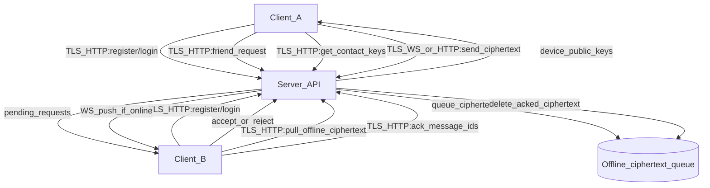

## COMP3334 Secure IM (1:1) — Design + Requirements Mapping

This repository is a **secure instant messaging (IM)** system for **1:1 private chat** under an **honest-but-curious (HbC)** server model. The server provides registration/authentication, friend/contact management, public key distribution, message relay, and **offline ciphertext store-and-forward**. **End-to-end encryption (E2EE) is a client responsibility.**

This README is a **design document** that maps directly to the COMP3334 requirements (R1–R25) and also states the **current implementation status** in this repository (**Implemented / Partial / Planned**). It is written to be consistent with the current codebase and does **not** claim unimplemented security properties as already delivered.

## Scope (project constraints)
- **1:1 only**: no group chat requirement.
- **No multi-device message synchronization requirement**: the current server implementation enforces **single active device** per user by deleting older device records on login.
- **Client UI**: a CLI client is acceptable.

## Required feature summary (what this system is designed to provide)
- **E2EE 1:1 private chat** (client-side; planned in this repo).
- **Timed self-destruct messages** (server best-effort TTL cleanup implemented for offline ciphertext; client deletion planned).
- **User registration + login (password + OTP)** (implemented on server).
- **Friend requests / contact management** (implemented on server).
- **Offline messaging (ciphertext store-and-forward)** (implemented on server).
- **Message delivery status (Sent / Delivered)** (semantics specified; implementation partial/planned).
- **Conversation list and unread counters** (client-side; planned in this repo).

## Threat model and security goals
### Threat model
- **HbC server**: follows the protocol but may inspect databases, logs, and all application-layer data; may perform traffic analysis (timestamps, message sizes, contact graph).
- **Network attacker**: may observe traffic and attempt MITM if transport security is misconfigured; may cause duplication/reordering at lower layers.
- **Malicious users/clients**: may create accounts, spam friend requests, send malformed messages, replay ciphertexts, or attempt impersonation at the UI layer.

### Security goals
- **End-to-end confidentiality against the server**: the server must not be able to decrypt message contents.
- **End-to-end integrity + authentication between users**: attackers should not forge/modify messages undetectably.
- **Replay resistance / de-duplication**: replayed/duplicated ciphertext must not be accepted as new.
- **Key change visibility**: identity key changes must be visible to users with a defined policy.

## System architecture (trust boundaries)
### Components
- **Client (planned/partial in this repo)**: E2EE logic (keys, handshake, AEAD), verification UI/state, replay window, self-destruct UI/local deletion, conversation list + unread counters + paging.
- **Server (implemented)**: registration/authentication, friend requests/contact management, public key distribution, message relay, offline ciphertext queue storage, best-effort TTL cleanup, and abuse controls (rate limiting).

### Trust boundaries
- **Trusted**: each client device’s local storage and runtime.
- **Untrusted**: server storage/logs and the network.

### Layering and separation of concerns
Server code follows a “separation of concerns” style: database/connection management, schemas (DTOs), authentication dependency, and routers are separated into focused files to keep each module’s responsibility clear.

### Data-flow overview



## Cryptographic design (E2EE) — client-side specification
**Status in this repository**: **Planned (not implemented in `Client/`)**.

The server currently transports an opaque `ciphertext` string. The design below specifies how clients must generate keys, establish sessions, encrypt messages, provide replay protection, implement key change visibility, and implement self-destruct. This is required for the system to actually achieve E2EE under the HbC model.

### Cryptographic library requirements (R4, R7, R8, Security Requirements)
We must use well-reviewed libraries for primitives (AEAD, signatures, KDF, RNG). Do not implement primitives.

For a Python client, acceptable options include:
- **`cryptography`**: AEAD (AES-GCM / ChaCha20-Poly1305), X25519, Ed25519, HKDF, SHA-256.
- **PyNaCl / libsodium bindings**: X25519/Ed25519, AEAD, hashing, RNG.

The report must record **library names and versions**, algorithm parameters (nonce sizes, key sizes), and how nonces/randomness are generated.

### Identity keys and verification (R4–R6)
- **Per-device identity keypair** (generated and stored locally by the client):
  - **Ed25519** identity signing keypair (authenticates handshake / identity).
  - **X25519** key agreement keypair (ECDH).
- **Server storage**: server stores only the device public keys needed for others to initiate sessions; **private keys never leave the client**.
- **Fingerprint / safety number UI**:
  - Fingerprint \(=\) `SHA-256(identity_signing_public_key)` encoded as Base32/hex.
  - Client lets the user mark a device as **Verified** (local-only state is acceptable).
- **Key change detection policy**:
  - If a contact’s identity key changes, show a warning and enforce the policy.
  - **Policy**: **block sending to that device until re-verified** (recommended, simple, and explicit).

### Secure session establishment (R7)
Protocol goal: authenticated key agreement without trusting the server.

One implementable design:
- **Key discovery**: fetch recipient device public keys from the server (only if friends).
- **Signed ephemeral ECDH handshake**:
  - Sender creates ephemeral X25519 keypair and sends `hello` containing:
    - sender identity signing public key identifier
    - sender ephemeral public key
    - signature over the handshake transcript (Ed25519)
  - Receiver verifies signature using the stored identity signing public key and replies with its own signed ephemeral public key.
  - Both sides compute ECDH shared secret and derive symmetric keys using **HKDF-SHA256**.

This is not a full Signal Double Ratchet; forward secrecy depends on ephemeral usage and re-handshake frequency. This limitation must be stated in the report.

#### Handshake wire format (planned)
The following JSON structures are **client-to-client logical messages** that the server relays as opaque ciphertext payloads (or as dedicated handshake messages, depending on client implementation).

```json
{
  "type": "E2EE_HELLO",
  "sender_uuid": "uuid-a",
  "receiver_uuid": "uuid-b",
  "sender_device_id": "device-id-a",
  "sender_identity_sign_pk": "base64(ed25519_pk)",
  "sender_ephemeral_dh_pk": "base64(x25519_ephemeral_pk)",
  "handshake_id": "uuid",
  "client_sent_time": "2026-04-07T12:00:00Z",
  "signature": "base64(ed25519_sig_over_transcript)"
}
```

```json
{
  "type": "E2EE_HELLO_ACK",
  "sender_uuid": "uuid-b",
  "receiver_uuid": "uuid-a",
  "sender_device_id": "device-id-b",
  "sender_identity_sign_pk": "base64(ed25519_pk)",
  "sender_ephemeral_dh_pk": "base64(x25519_ephemeral_pk)",
  "handshake_id": "uuid",
  "client_sent_time": "2026-04-07T12:00:01Z",
  "signature": "base64(ed25519_sig_over_transcript)"
}
```

After both sides verify signatures, they compute:
- \(ss = X25519(ephemeral\_sk, peer\_ephemeral\_pk)\)
- `session_id = SHA-256(transcript_bytes)`
- `k_send`, `k_recv` from `HKDF-SHA256(ss, salt=session_id, info=...)`

### Message encryption + authentication (R8)
- Use a well-reviewed crypto library. Do not implement primitives.
- **AEAD**: ChaCha20-Poly1305 (preferred) or AES-256-GCM.
- **Associated data (AD)** binds metadata so tampering is detected:
  - `sender_uuid`, `receiver_uuid`, `conversation_id`
  - `session_id` (e.g., hash of handshake transcript)
  - `message_counter` (monotonic per session and direction)
  - `ttl_seconds`, `client_sent_time`
- **Nonce**:
  - Must be unique per key. Recommended: derive from `message_counter` (carefully) or use 96-bit random nonces with strict de-dup in sender state.

#### Encrypted message wire format (planned)
Ciphertext is produced by AEAD over `plaintext`, with AD constructed from the fields below.

```json
{
  "type": "E2EE_MSG",
  "sender_uuid": "uuid-a",
  "receiver_uuid": "uuid-b",
  "conversation_id": "canonical(uuid-a,uuid-b)",
  "session_id": "hex(sha256(handshake_transcript))",
  "message_id": "uuid",
  "message_counter": 42,
  "ttl_seconds": 600,
  "client_sent_time": "2026-04-07T12:00:10Z",
  "nonce": "base64(12_bytes)",
  "ciphertext": "base64(aead_ciphertext)",
  "tag": "base64(aead_tag)"
}
```

Recommended receiver replay window: keep the **last N counters** per session/direction (e.g., `N=2048`) and reject duplicates.

### Replay protection / de-duplication (R9, R22)
- Receiver maintains per-session replay state:
  - highest seen `message_counter` and a sliding window, or a set of recently seen counters.
- Replayed/duplicated ciphertext is ignored.

### Timed self-destruct messages (R10–R12)
- TTL is included in authenticated metadata (AD) so it cannot be modified undetectably.
- **Client behavior**: delete expired messages from UI and local storage.
- **Server behavior (best-effort)**: delete queued offline ciphertext after expiry.
- Known limitation: cannot prevent screenshots/copy/paste or a malicious client.

### Delivery status semantics + metadata disclosure (R17–R19)
- **Sent**: sender successfully submitted the ciphertext to the server.
- **Delivered** (recommended Option B): recipient client sends an **E2EE-protected delivery receipt** back to sender (AEAD message), acknowledging message identifier(s) / counter(s).
- **Metadata disclosure**: server learns relationship graph (who contacts whom), timing, message sizes, and online/offline patterns; E2EE does not hide this from an HbC server.

#### Delivery receipt wire format (planned)
Receipts are E2EE messages of type `E2EE_RECEIPT` encrypted under the same session keys.

```json
{
  "type": "E2EE_RECEIPT",
  "sender_uuid": "uuid-b",
  "receiver_uuid": "uuid-a",
  "session_id": "hex(...)",
  "acked_message_ids": ["uuid1", "uuid2"],
  "acked_counters": [41, 42],
  "client_sent_time": "2026-04-07T12:00:30Z",
  "nonce": "base64(12_bytes)",
  "ciphertext": "base64(...)",
  "tag": "base64(...)"
}
```

## Repository implementation overview (what exists today)
### Tech stack
- Python + FastAPI (ASGI) + Uvicorn
- SQLAlchemy + SQLite
- Argon2 password hashing (`argon2-cffi`)
- OTP (TOTP) via `pyotp`
- JWT via `pyjwt`
- Rate limiting via `slowapi`

Dependencies: `requirements.txt`

Notes (truthful):
- The server code imports `pyotp` for TOTP; ensure it is installed in the environment even though the current `requirements.txt` does not pin it.
- Secrets should not be committed. If a `.env` file exists in the repo, treat it as a **local-only** file and rotate any embedded secrets before deployment.

### Server modules and code pointers
Note: the server directory is named `Sever/` in this repository.

- **Entry point**: `Sever/MainServer.py`
- **Config (.env)**: `Sever/config.py`
- **DB schema**: `Sever/Server_db.py`
- **DB session manager**: `Sever/SdbManager.py`
- **Rate limiting**: `Sever/limitor.py`
- **JWT dependency**: `Sever/Dependency.py`
- **Routers**:
  - Register: `Sever/routers/Register.py`
  - Login: `Sever/routers/Login.py`
  - Contacts: `Sever/routers/Contacts.py`
  - Messages (offline queue + ACK): `Sever/routers/Message.py`
  - WebSocket relay: `Sever/routers/ChatWS.py` + `Sever/ws_manager.py`
- **TTL cleanup task**: `Sever/task.py`

### Client stubs in this repo
- DTOs/contracts: `Client/Schema.py`
- Local DB tables: `Client/CLient_db.py`
- Local DB manager: `Client/CdbManager.py`

## Requirements coverage (R1–R25)
Legend: **Implemented** = exists in code now; **Partial** = some parts exist; **Planned** = design is specified here but not implemented in this repo yet.

### Accounts & authentication
- **R1 Registration**
  - **Design**: register with unique email; store password using modern password hashing; enforce basic password policy and rate limiting.
  - **Status**: **Implemented** (server).
  - **Pointers**: `Sever/routers/Register.py`, `Sever/Server_db.py`, `Sever/limitor.py`.
- **R2 Login with password + OTP**
  - **Design**: password + TOTP; issue expiring session tokens bound to user.
  - **Status**: **Implemented** (server).
  - **Pointers**: `Sever/routers/Login.py`, `Sever/config.py`.
- **R3 Logout / session invalidation**
  - **Design**: logout must promptly revoke/expire tokens.
  - **Status**: **Partial** (token expiry exists; explicit revocation/invalidation not implemented).
  - **Pointers**: `Sever/Dependency.py`, `Sever/config.py`.

### Identity & key management
- **R4 Per-device identity keypair**
  - **Design**: client generates and stores long-term identity keypair locally; server stores only public key(s) for initiation.
  - **Status**: **Partial** (server stores `device_public_key` at login; client key generation/storage not implemented).
  - **Pointers**: `Sever/routers/Login.py`, `Sever/Server_db.py`, `Client/CLient_db.py`.
- **R5 Fingerprint / verification UI**
  - **Design**: display fingerprint/safety number; user can mark as verified (local-only is acceptable).
  - **Status**: **Planned**.
- **R6 Key change detection**
  - **Design**: warn on key change; block sending until re-verified.
  - **Status**: **Planned**.

### E2EE 1:1 messaging
- **R7 Secure session establishment**
  - **Design**: signed ephemeral ECDH handshake (above).
  - **Status**: **Planned**.
- **R8 Message encryption + authentication**
  - **Design**: AEAD with AD binding critical metadata.
  - **Status**: **Planned** (server currently accepts opaque `ciphertext`).
- **R9 Replay protection / de-duplication**
  - **Design**: counters + replay window (above).
  - **Status**: **Planned**.

### Timed self-destruct messages
- **R10 TTL / expiration policy**
  - **Design**: TTL included in authenticated metadata; server best-effort enforces TTL for offline ciphertext.
  - **Status**: **Partial** (server stores TTL and cleans expired offline messages; client-authenticated TTL not implemented).
  - **Pointers**: `Sever/Schema.py`, `Sever/Server_db.py`, `Sever/task.py`.
- **R11 Client deletion behavior**
  - **Design**: delete from UI and local storage after expiry.
  - **Status**: **Planned**.
- **R12 Server storage behavior (best-effort)**
  - **Design**: delete queued ciphertext after expiry.
  - **Status**: **Implemented** (best-effort cleanup loop).
  - **Pointers**: `Sever/task.py`.

### Friends / contacts
- **R13 Friend request workflow**
  - **Design**: request → accept/decline (not instant add), request by email.
  - **Status**: **Implemented**.
  - **Pointers**: `Sever/routers/Contacts.py`.
- **R14 Request lifecycle**
  - **Design**: accept/decline; sender cancel; both can view pending.
  - **Status**: **Implemented**.
  - **Pointers**: `Sever/routers/Contacts.py`.
- **R15 Blocking / removing**
  - **Design**: block users; blocked users’ requests/messages are ignored.
  - **Status**: **Partial** (blocking exists; explicit “remove friend” is not implemented as a dedicated endpoint).
  - **Pointers**: `Sever/routers/Contacts.py`, `Sever/routers/Message.py`, `Sever/routers/ChatWS.py`.
- **R16 Default anti-spam control**
  - **Design**: non-friends cannot send arbitrary chat messages; only friend requests.
  - **Status**: **Implemented** (server drops/fakes response for blocked/non-friends).
  - **Pointers**: `Sever/routers/Message.py`.

### Message delivery status
- **R17 Minimum delivery states**
  - **Design**: Sent + Delivered.
  - **Status**: **Partial** (current API uses `UNRECEIVED`; full Sent/Delivered semantics not implemented).
  - **Pointers**: `Sever/Schema.py`, `Sever/routers/Message.py`.
- **R18 Define “Delivered” semantics**
  - **Design**: Option B delivery receipt (E2EE-protected) from recipient to sender.
  - **Status**: **Planned**.
- **R19 Metadata disclosure statement**
  - **Design**: stated above; server learns timing/graph/size metadata.
  - **Status**: **Specified** (design-level requirement).

### Offline messaging (ciphertext store-and-forward)
- **R20 Offline ciphertext queue**
  - **Design**: if recipient offline, queue ciphertext and relay when online.
  - **Status**: **Implemented**.
  - **Pointers**: `Sever/routers/Message.py`, `Sever/routers/ChatWS.py`.
- **R21 Retention and cleanup**
  - **Design**: delete after ACK or after max age; respect TTL best-effort for queued ciphertext.
  - **Status**: **Implemented** (ACK delete + TTL cleanup).
  - **Pointers**: `Sever/routers/Message.py`, `Sever/task.py`.
- **R22 Duplicate/replay robustness**
  - **Design**: client-side replay protection; safe handling of duplicates from retries.
  - **Status**: **Partial** (server supports ACK delete by IDs; client replay protection planned).

### Conversation list & unread counters
- **R23 Conversation list**
  - **Design**: client shows conversation list ordered by most recent activity.
  - **Status**: **Planned** (client tables exist).
  - **Pointers**: `Client/CLient_db.py`.
- **R24 Unread counters**
  - **Design**: maintain unread count per conversation and update on open/read.
  - **Status**: **Planned**.
  - **Pointers**: `Client/CLient_db.py`.
- **R25 Paging / incremental loading**
  - **Design**: incremental load from local DB; extend server APIs with paging if needed.
  - **Status**: **Planned**.

## Security engineering requirements (non-functional)
### Transport security (TLS) — required
- **Requirement**: all client-server connections must use **TLS** (protect against network attackers and credential theft).
- **Status**: **Not configured in code** (Uvicorn runs without TLS; WebSocket is `ws://` not `wss://`).
- **Deployment options**:
  - **Reverse proxy TLS termination (recommended)**: Nginx/Caddy terminates TLS and proxies to the FastAPI server.
  - **Uvicorn TLS**: start Uvicorn with `--ssl-keyfile` and `--ssl-certfile`.

### Secure randomness
- Keys and nonces must come from a cryptographically secure RNG (library/OS-provided).

### Secure local storage (client)
- Private keys and protocol state must be protected at rest (OS keychain or encrypted local DB). **Planned**.

### Input validation and size limits
- Server uses Pydantic schemas to validate structure and basic types.
- **Planned**: enforce explicit maximum sizes (e.g., ciphertext length limits) and reject oversized payloads.

### Minimal sensitive logging
- Do not log secrets (passwords, OTP seeds, JWTs, private keys, decrypted plaintext).
- Keep debug logs off by default in production deployments.

### Basic abuse controls
- Rate limiting exists for register/login.
- **Planned**: add rate limiting for friend requests and message send endpoints.

## Deployment and usage (step-by-step)
This guide is intentionally minimal but complete. It avoids assuming pre-installed third-party libraries beyond Python itself.

### Ubuntu / WSL (Linux)
1. Install Python 3.11+ and pip.
2. (Recommended) Create and activate a virtual environment.
3. From repo root, install dependencies:
   - `pip install -r requirements.txt`
4. Create `Sever/.env` (do not commit secrets):
   - `JWT_SECRET_KEY=<random_secret>`
   - `JWT_ALGORITHM=HS256`
   - `ACCESS_TOKEN_EXPIRE_DAYS=7`
5. Start server:
   - `python Sever/MainServer.py`
6. Verify health:
   - `GET /` should return a JSON status message.
7. Open Swagger docs:
   - `/docs`

### Windows 11
1. Install Python 3.11+.
2. In PowerShell at repo root:
   - `pip install -r requirements.txt`
3. Create `Sever\\.env` (same variables as above).
4. Run:
   - `python Sever\\MainServer.py`

### Database initialization
- The server uses SQLite. Tables are created automatically on startup by SQLAlchemy.
- Default server DB file: `sdb.db` (created in the working directory where the server starts).

### TLS deployment (required)
E2EE does not replace TLS. Deploy with TLS using either:
- **Reverse proxy (recommended)**: terminate TLS at Nginx/Caddy and proxy to the FastAPI server on `127.0.0.1:8000`.
- **Direct Uvicorn TLS**: start Uvicorn with certificate and key files.

### WebSocket usage (current server)
- Endpoint: `/ws/chat?token=<JWT>`
- Client sends JSON:
  - `{ "receiver_uuid": "...", "ciphertext": "...", "expire_duration": 86400 }`
- Server forwards JSON:
  - `{ "type": "NEW_MESSAGE", "sender_uuid": "...", "ciphertext": "...", "timestamp": "..." }`

### HTTP API quickstart (current server)
All HTTP endpoints are under `/api/v1` and require `Authorization: Bearer <JWT>` unless noted.

- **Register** (no auth): `POST /api/v1/register`
- **Login** (no auth): `POST /api/v1/login`
- **Friend request**: `POST /api/v1/friends/request`
- **Pending requests**: `GET /api/v1/friends/pending`
- **Accept/reject**: `POST /api/v1/friends/action`
- **Cancel sent request**: `DELETE /api/v1/friends/request/{request_id}`
- **Friend list**: `GET /api/v1/friends`
- **Block**: `POST /api/v1/friends/block`
- **Fetch contact keys**: `GET /api/v1/friends/{contact_uuid}/keys`
- **Send ciphertext (HTTP)**: `POST /api/v1/messages/send`
- **Pull offline ciphertext**: `GET /api/v1/messages/offline`
- **ACK delete**: `POST /api/v1/messages/ack`

## Testing & evaluation (what to demonstrate)
### Demonstration checklist
- Register + TOTP enrollment, login, JWT-protected endpoints.
- Friend request workflow (request, pending, accept/reject, cancel).
- Offline messaging: send while recipient offline, pull, ACK delete.
- TTL cleanup: expired offline messages removed (best-effort).

### Security test cases (minimum 2)
- **Replay test (planned client)**: resend a previously accepted ciphertext/counter; receiver must drop it.
- **Key change visibility test (planned client)**: rotate a contact’s identity key; client must warn and enforce the chosen policy.

## Limitations and future work (truthful)
- The E2EE protocol, replay protection, delivery receipts, key verification UI/state, and conversation list/unread/paging are **specified in this README but not implemented** in `Client/` yet.
- TLS must be added at deployment time to satisfy the project requirement.
- Server-side token revocation/invalidation on logout is not implemented (expiry exists).
